## 2. Réalisation de tests via le protocole ICMP
Pour valider notre configuration, nous utilisons une machine cliente **Microsoft Windows 10** placée dans le réseau **LAN**.

### Vérification du réseau
La machine doit être capable de joindre l'interface web d'administration de pfSense. Nous commençons par vérifier les paramètres réseau de la machine avec la commande `ipconfig /all`.

> **Captures des tests Windows 10 :**

> 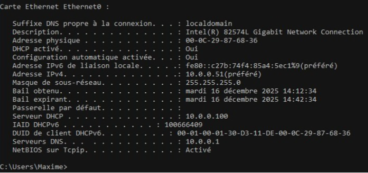
> 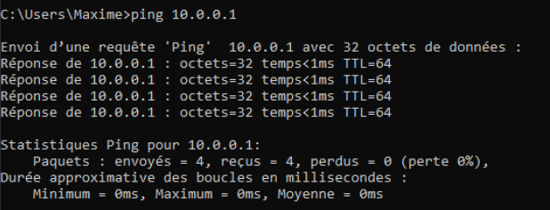
> 

## 3. Connexion à l’interface web (LAN)

Une fois le réseau configuré, l'administration se fait via l'interface graphique depuis la machine cliente Windows 10.

### Accès à l'interface
Nous ouvrons un navigateur web et entrons l'adresse IP du LAN de pfSense (`10.0.0.1`).

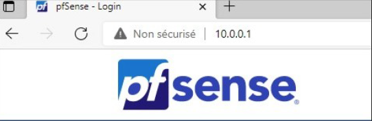

### Authentification
Pour la première connexion, nous utilisons les identifiants par défaut de pfSense :
* **Utilisateur :** `admin`
* **Mot de passe :** `pfsense`

### Assistant de configuration (Setup Wizard)
Après la connexion, pfSense lance un assistant pour finaliser les paramètres système.

Nous renseignons ensuite les informations d'identité du routeur ainsi que les serveurs DNS pour la résolution de noms.
* **Hostname :** (ex: pfSense)
* **Domain :** (ex: tssr.lab)
* **DNS :** 10.0.0.1 (DNS externes comme 1.1.1.1)

## 4. Vérification et sécurisation finale

### Validation des interfaces WAN et LAN
L'adresse WAN ayant été configurée précédemment via le Shell, nous validons ici que les paramètres ont bien été repris par l'interface Web.

Il en va de même pour l'interface LAN, qui servira de passerelle pour nos clients internes.

### Sécurisation de l'accès
Par mesure de sécurité, nous procédons immédiatement à la modification du mot de passe de l'administrateur (`admin`) pour remplacer celui par défaut.

### État actuel de l'infrastructure
Voici le tableau de bord récapitulatif après cette première phase de configuration. 

> **Note :** On s'aperçoit à ce stade que si le WAN et le LAN sont opérationnels, la **DMZ** (visible sous le nom `OPT1`) reste encore à être configurée au niveau de l'adressage et de son nommage définitif.

## 5. Création et configuration de la zone DMZ

La DMZ (Demilitarized Zone) est essentielle pour isoler notre serveur Web du reste du réseau local (LAN). 

### Configuration de l'interface
Nous nous rendons dans le menu **Interfaces > OPT1**. Pour rendre l'administration plus claire, nous effectuons les modifications suivantes :
1. **Description :** Changement du nom par défaut `OPT1` en **DMZ**.
2. **Configuration IPv4 :** Nous vérifions que l'adresse IP de la passerelle (l'interface du pfSense côté DMZ) correspond bien à notre plan d'adressage (`172.16.0.1/24`).

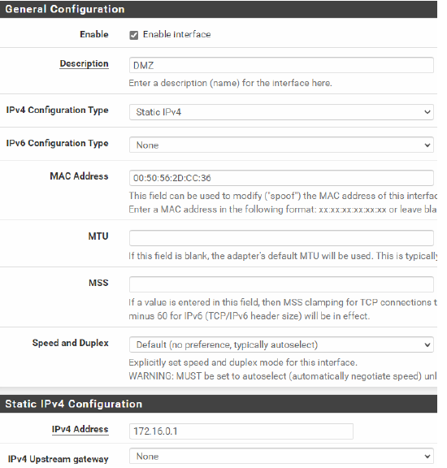

Une fois ces modifications appliquées, la DMZ est officiellement active et prête à recevoir les règles de filtrage pour sécuriser les flux entrants et sortants.

---

## 6. Configuration des services réseau (LAN)

### Serveur DHCP
Afin d'automatiser l'adressage sur le réseau local, nous configurons pfSense comme serveur DHCP unique pour l'interface LAN.
* **Plage d'adresses (Scope) :** `10.0.0.50` à `10.0.0.100`
* **Passerelle :** `10.0.0.1`

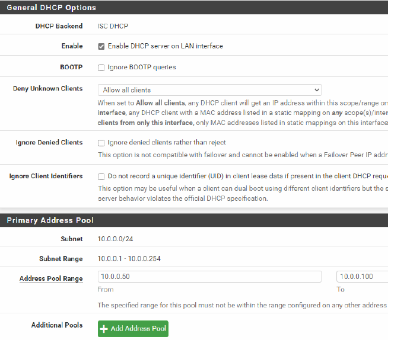

### Résolution de noms (DNS Resolver)
Nous configurons le **DNS Resolver** (Unbound) pour que pfSense assure la résolution de noms sur le LAN. 
1. Activation du service sur l'interface LAN.
2. Activation de l'option de résolution pour les clients DHCP (permet de résoudre les noms d'hôtes locaux).

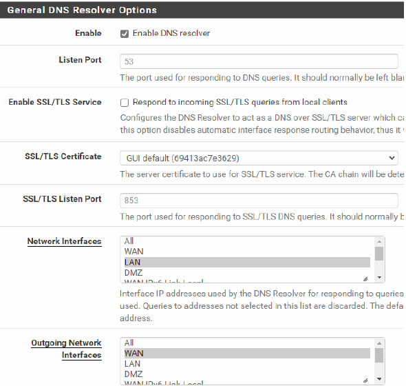
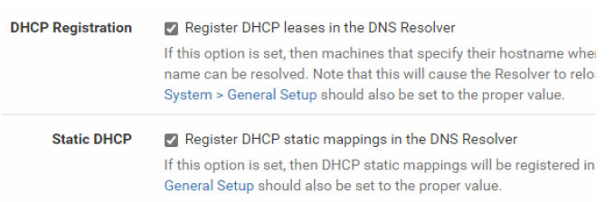

## 7. Tests de connectivité et validation (ICMP)

### Validation du bail DHCP
Après avoir désactivé le serveur DHCP de VMware Workstation (VMnet10) pour éviter les conflits, nous renouvelons l'adresse IP sur la machine cliente Windows 10. La commande `ipconfig /all` confirme que pfSense (`10.0.0.1`) a bien attribué une adresse dans la plage prévue.

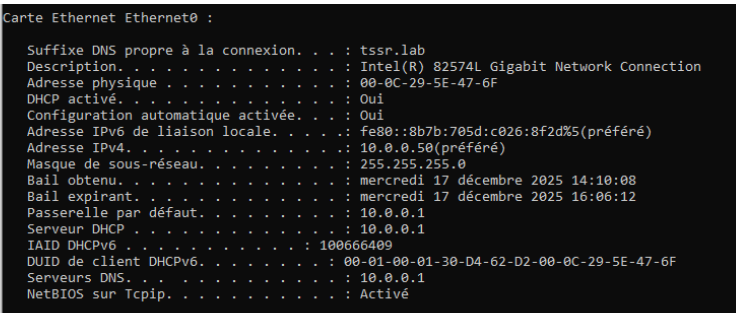

### Tests de communication
Pour valider l'ensemble de la pile réseau (L1 à L7), nous effectuons une série de pings :

1. **Ping de la passerelle :** Vérifie la connectivité locale avec pfSense.
   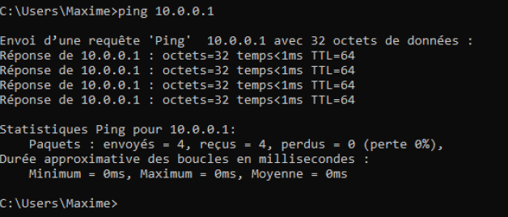
2. **Ping DNS Cloudflare (1.1.1.1) :** Vérifie l'accès à l'Internet extérieur (routage/NAT).
   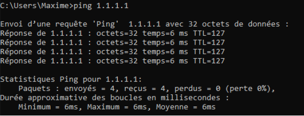
3. **Résolution Google.com :** Vérifie que le résolveur DNS de pfSense fonctionne correctement.
   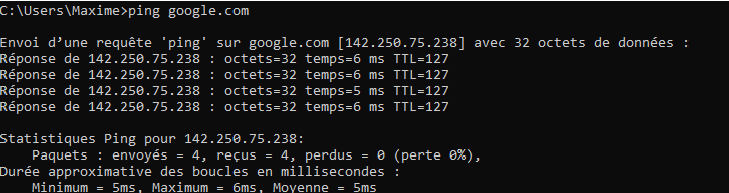

   ## 2. Définition des règles du pare-feu

Pour garantir la sécurité de l'infrastructure, nous avons défini une politique de filtrage stricte sur pfSense. L'objectif est de compartimenter les flux afin qu'une compromission sur une zone (notamment la DMZ, exposée à l'extérieur) ne puisse pas impacter les autres zones sensibles comme le LAN.

Le tableau ci-dessous détaille la matrice de flux que nous avons implémentée :

### Détails de la configuration par interface

#### 🛡️ Interface WAN
L'accès depuis l'extérieur est strictement limité aux services Web. Une règle de redirection de port (NAT) a été mise en place pour acheminer le trafic public (ports 80 et 443) vers l'adresse IP privée du serveur Debian situé dans la DMZ.

#### 💻 Interface LAN
Le réseau local est la zone de gestion. Les administrateurs peuvent accéder au serveur en DMZ via le protocole SSH pour la maintenance technique ou en HTTP pour vérifier le bon déploiement du site Web.

#### 🌐 Interface DMZ (Isolation)
C'est la règle la plus critique de notre architecture : **la DMZ ne peut en aucun cas initier de connexion vers le LAN**. En cas d'intrusion sur le serveur Web, l'attaquant est ainsi confiné dans cette zone isolée. Les seuls flux sortants autorisés sont dirigés vers l'Internet pour permettre la récupération des paquets de mise à jour du système.

## 3. Configuration de la passerelle WAN (VMnet8)

Pour permettre l'accès à Internet à l'ensemble de notre architecture, nous devons configurer la passerelle par défaut sur l'interface WAN. Cette interface est reliée au commutateur virtuel **VMnet8 (NAT)** de VMware, qui assure la liaison avec le réseau physique.

### Paramétrage du Gateway
Nous renseignons l'adresse IP de la passerelle NAT de VMware (généralement la `.2` du sous-réseau configuré) pour que pfSense puisse router le trafic vers l'extérieur.

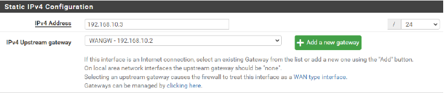

Cette étape est indispensable pour que le serveur Debian puisse effectuer ses mises à jour et que les clients du LAN puissent naviguer sur le Web.

## 4. Configuration détaillée des flux et redirections

Cette section détaille la mise en place technique de la matrice de flux, allant de l'ouverture des services Web à l'isolation stricte de la DMZ.

### A. Accès Public (NAT / Port Forwarding)
Pour rendre notre futur serveur Web accessible depuis l'extérieur, nous avons configuré des redirections de ports sur l'interface WAN :
* **Port 80 (HTTP) :** Redirection vers le serveur Web en DMZ.
  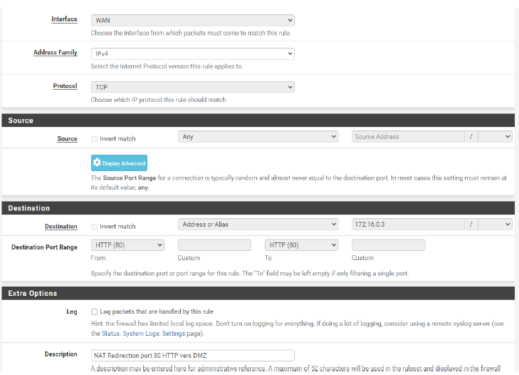
* **Port 443 (HTTPS) :** Redirection sécurisée vers le serveur Web.
  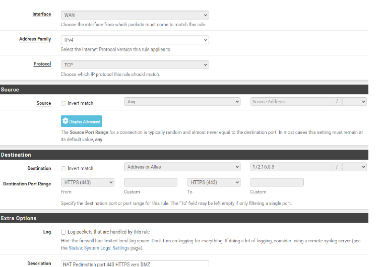

### B. Administration depuis le LAN
Le réseau local doit pouvoir administrer et consulter le serveur en DMZ :
* **Flux HTTP (Port 80) :** Autorisation pour la vérification du site.
  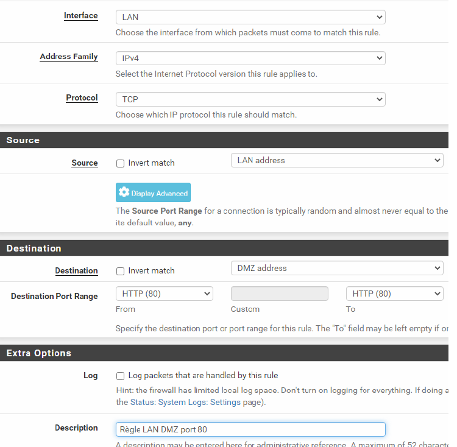
* **Flux SSH (Port 22) :** Autorisation pour l'administration distante du serveur Debian.
  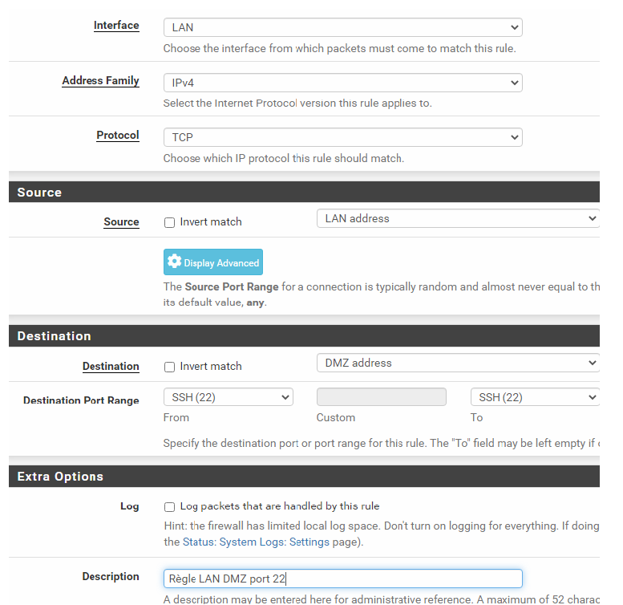

### C. Sécurisation et Isolation de la DMZ
La sécurité repose sur le cloisonnement. Nous avons appliqué les règles suivantes sur l'interface DMZ :
1. **Interdiction DMZ vers LAN :** Isolation totale pour éviter qu'un serveur compromis n'accède au réseau interne.
   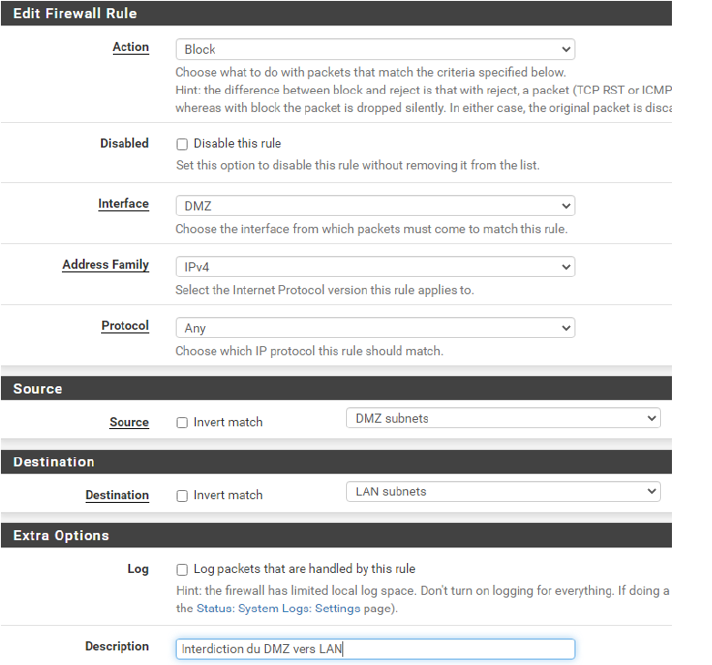
2. **Accès Internet (Mises à jour) :** Règle temporaire permettant au serveur de récupérer ses paquets.
   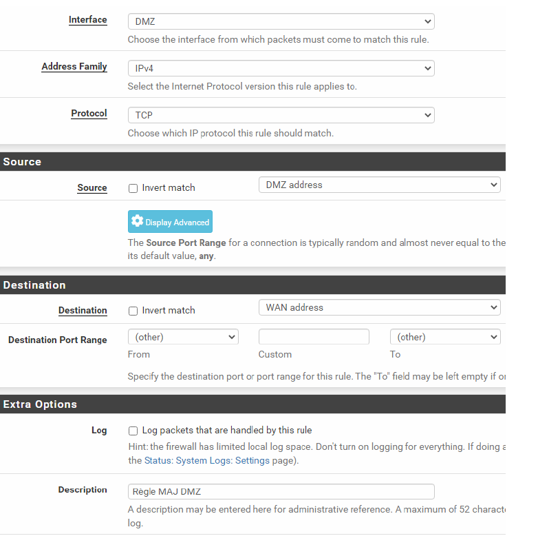
3. **Flux DNS :** Autorisation des requêtes DNS de la DMZ vers le WAN pour la résolution de noms.
   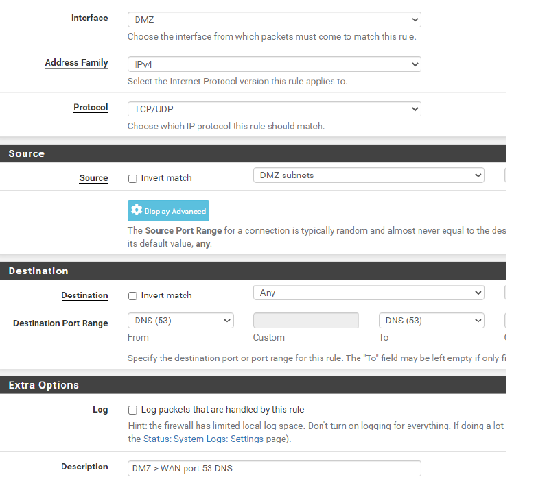

### D. Synthèse des règles par interface
Voici l'état final des tables de filtrage après configuration :

* **Résultats Interface WAN :**
  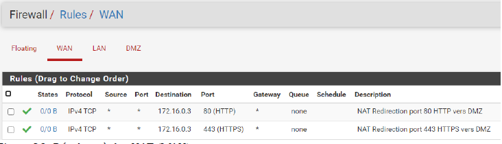
* **Résultats Interface LAN :**
  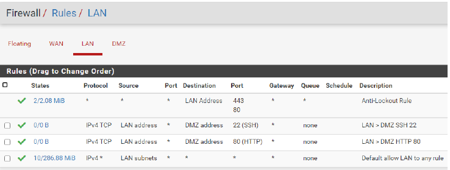
* **Résultats Interface DMZ :**
  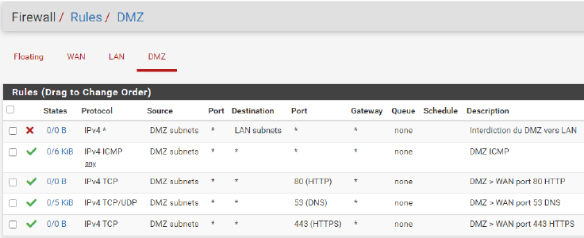

  

