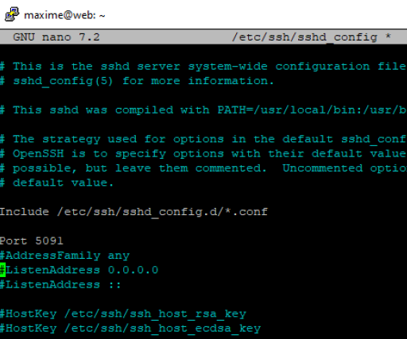
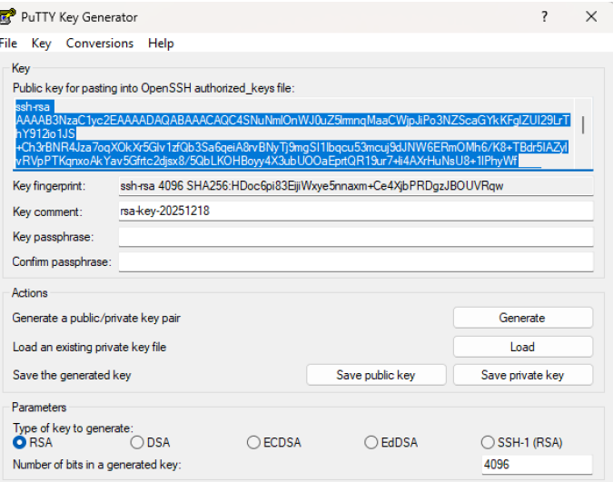
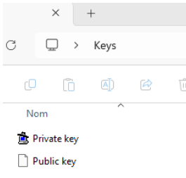
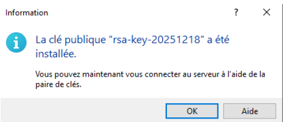
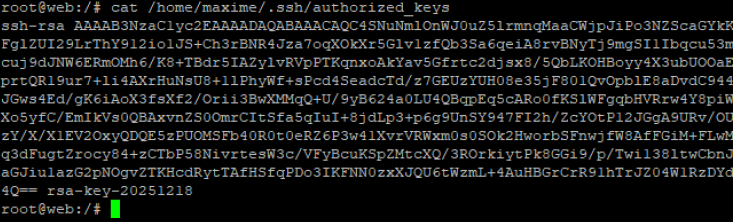
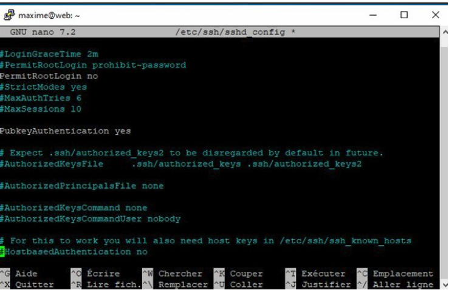
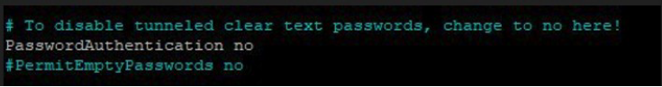
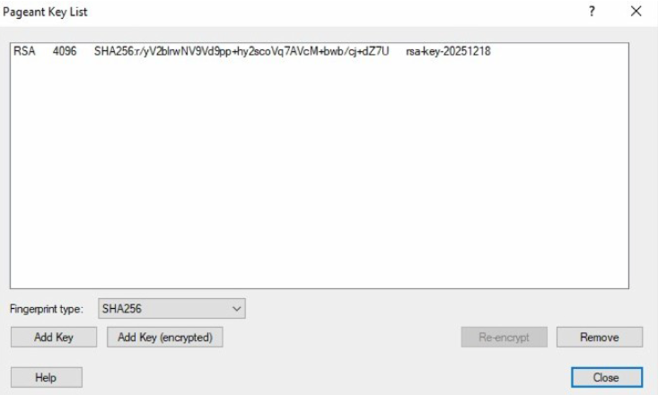
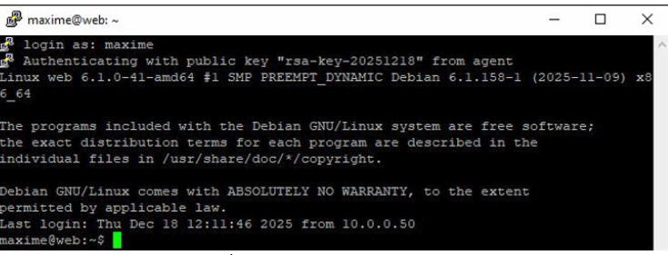

# V. Sécurisation du serveur (Hardening SSH)

Après avoir isolé le serveur au niveau réseau, nous appliquons les bonnes pratiques de cybersécurité directement sur le système pour limiter la surface d'attaque.

## 1. Changement du port SSH par défaut
Le port 22 est la cible prioritaire des robots de scan et des attaques par force brute. Nous modifions le port d'écoute pour le **5091**.

## 2. Authentification par clés asymétriques
Pour supprimer le risque lié aux mots de passe (souvent trop simples ou vulnérables au brute-force), nous mettons en place une authentification par paire de clés (publique/privée).

### A. Génération des clés
Utilisation de **PuTTYgen** pour générer une paire de clés robuste.

### B. Sauvegarde sécurisée
Il est impératif de conserver la clé privée en lieu sûr et de ne jamais la partager.

## 3. Déploiement de la clé publique
Nous utilisons **WinSCP** pour transférer la clé publique sur le serveur Debian. Celle-ci est ajoutée au fichier `authorized_keys`.

* **Vérification sur le serveur :** Nous confirmons la présence de la clé dans le répertoire sécurisé de l'utilisateur (ici `/root/.ssh/`).

## 4. Désactivation des accès vulnérables
Une fois l'accès par clé validé, nous durcissons la configuration du service SSH (`sshd_config`) :
* **Interdiction du login Root :** Pour forcer l'usage d'un utilisateur standard ou sécurisé.
* **Désactivation des mots de passe :** Seule l'authentification par clé est désormais autorisée.

## 5. Test de connexion finale
Pour faciliter la connexion, nous importons la clé privée dans **Pageant** (agent SSH de PuTTY). L'authentification se fait désormais de manière transparente et sécurisée, sans qu'aucun mot de passe ne soit demandé ou ne circule sur le réseau.

* **Chargement de la clé :**

* **Résultat de la connexion :**

